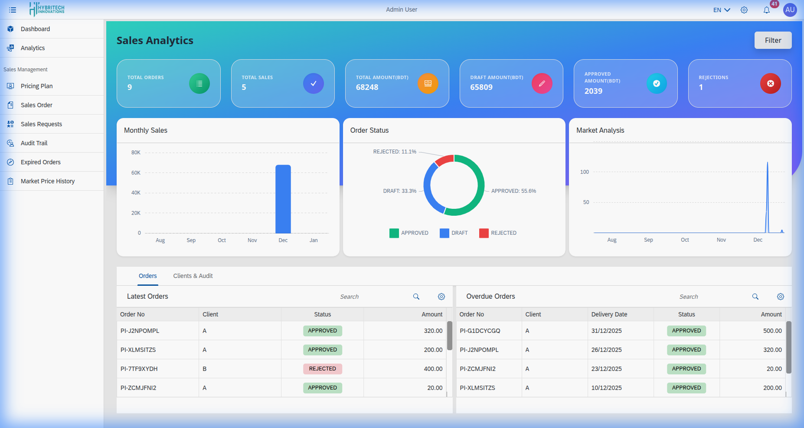
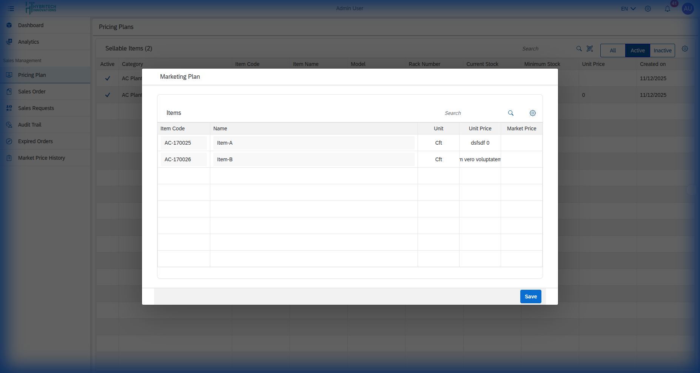
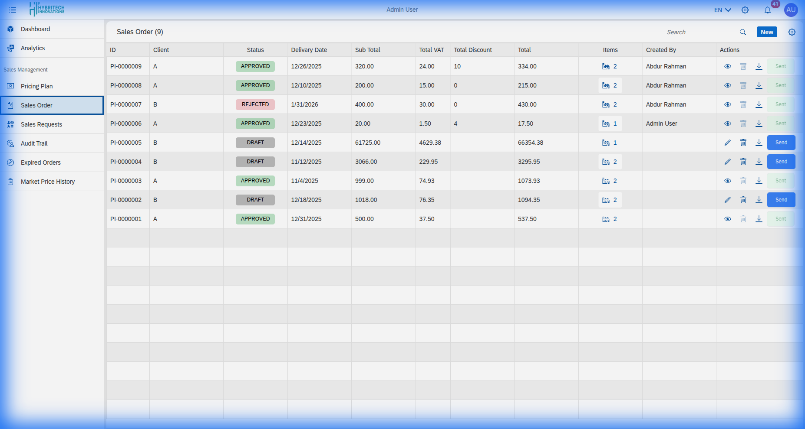
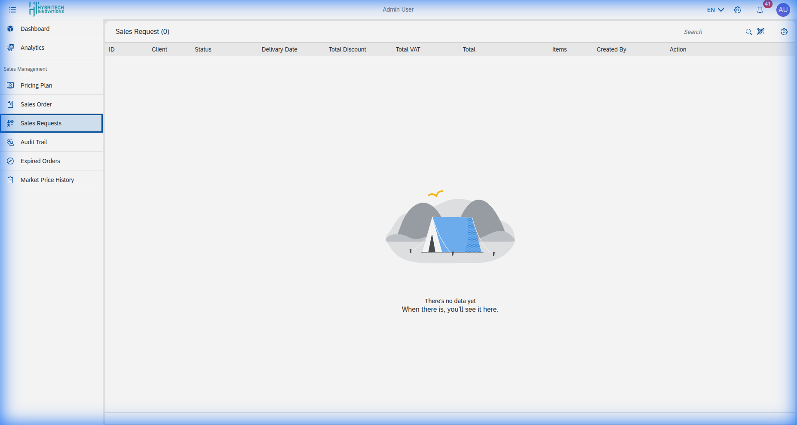
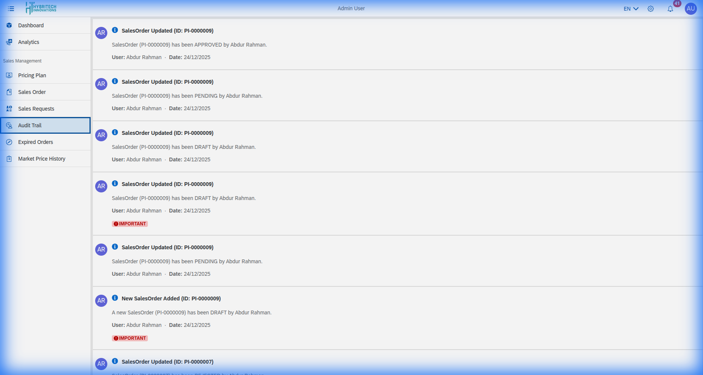
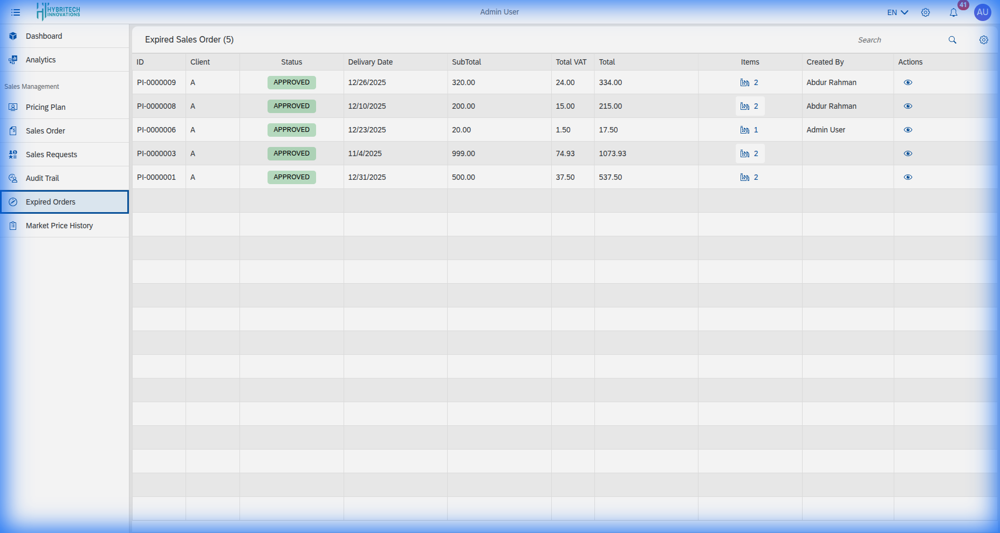
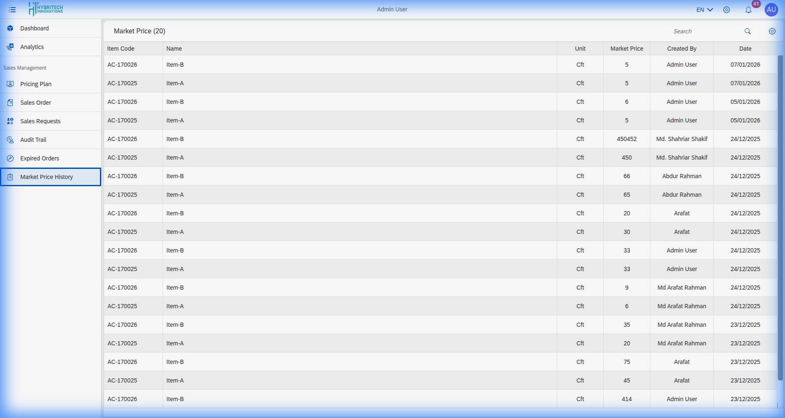

# Sales Management

## Table Of Contents

- [Sidebar Navigation](#sidebar-navigation)
- [Sales Analytics](#sales-analytics)
  - [Analytics Summary Cards](#analytics-summary-cards)
  - [Monthly Sales](#monthly-sales)
  - [Order Status](#order-status)
  - [Market Analysis](#market-analysis)
- [Orders Tab](#orders-tab)
- [Clients & Audit Tab](#clients--audit-tab)
- [Pricing Plan](#pricing-plan)
- [Sales Order](#sales-order)
  - [Creating a New Sales Order](#creating-a-new-sales-order)
- [Sales Request](#sales-request)
- [Audit Trail](#audit-trail)
- [Expired Orders](#expired-orders)
- [Market Price History](#market-price-history)

## Sidebar Navigation

The Sales Module sidebar serves as the primary navigation panel, providing users with structured access to all available sales-related functionalities. The sidebar includes menu options such as Analytics, and essential sales management features including Pricing Plan, Sales Order, Sales Requests, Audit Trail, Expired Orders, and Market Price History.

## Sales Analytics

The Sales Analytics screen provides a centralized and comprehensive overview of sales performance. It displays key business metrics, visual summaries, and actionable insights.

### Analytics Summary Cards
Displays high-level indicators like Total Orders, Total Sales, Total Amount, Draft Amount, Approved Amount, and Rejections.

### Monthly Sales
A bar chart showing sales per month, defaulting to the past 6 months.

### Order Status
A chart displaying the percentage ratio of all sales orders by their current status.

### Market Analysis
A line chart displaying commodity price fluctuations over time.

## Orders Tab

- **Latest Orders:** Track recent transactions and statuses.
- **Overdue Orders:** Identify orders that missed scheduled delivery dates.

## Clients & Audit Tab

- **Top Client List:** View most valuable customers by spending.
- **Recent Audit Trail:** Monitor system security by tracking order updates.

## Pricing Plan

Provides a centralized interface for managing sellable items, including details like category, stock levels, and unit prices. It allows for time-based pricing configurations.

## Sales Order

A comprehensive interface for managing customer orders. Users can create, search, and manage orders. Orders in 'Draft' status can be edited, but once submitted as a 'Sales Request', they can only be viewed.

### Creating a New Sales Order
Form for selecting clients, delivery dates, and associating sellable items with specific quantities and discounts.

## Sales Request

Displays all submitted sales orders for review and authorization by authorized users (approve/reject).

## Audit Trail

A chronological log of all significant actions (Pending, Approved, Rejected, Draft) performed on sales orders.

## Expired Orders

Lists approved sales orders whose delivery dates have passed without fulfillment.

## Market Price History

A date-wise record of market prices for individual sellable items.

