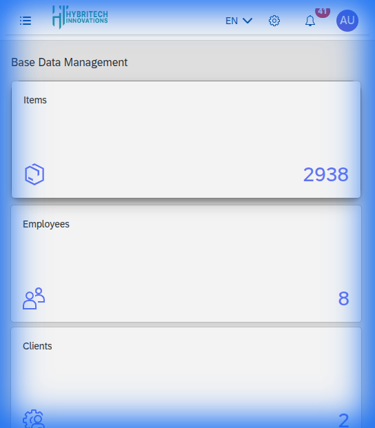

# Base Data Management

This module allows for the configuration of foundational data used across the system.

## Master Data

- **Items**: Manage product and material definitions (Current count: ~2900).
- **Employees**: Maintain employee records and access.
- **Clients**: Manage client information and relationships.
