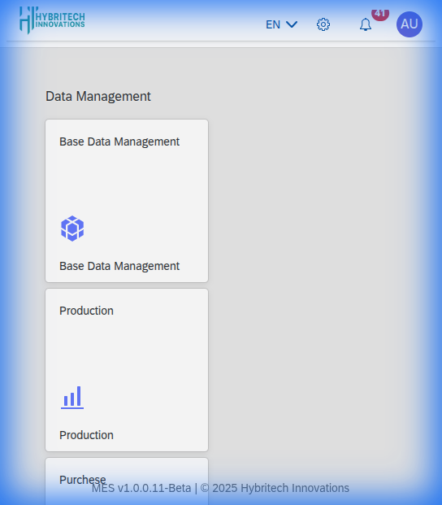

# Hybritech Manufacturing Execution System (MES)

Welcome to the documentation for the Hybritech MES. This system creates an integrated workflow for monitoring production monitoring, procurement, inventory management, and quality control.

## Dashboard Overview

The Dashboard serves as the central launchpad for all system modules.

### Key Modules

- **Production**: Monitor machine efficiency and status in real-time.
- **Purchase**: Manage procurement, orders, and suppliers.
- **Store Management**: Track inventory levels, stock value, and material movements.
- **QA & QC**: Ensure product quality standards (currently under development).
- **Base Data Management**: Configure system-wide master data.
- **Sales**: Manage sales orders, clients, and audit trail.