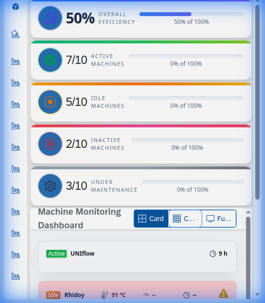

# Production Module

The Production module focuses on real-time monitoring of the manufacturing floor.

## Features

- **Machine Monitoring**: View the Overall Efficiency (OEE) and status of all connected machines.
- **Real-time Status**: Instantly identify which machines are Active, Idle, Inactive, or in Maintenance.
- **Efficiency Metrics**: Track performance metrics to optimize production workflows.
