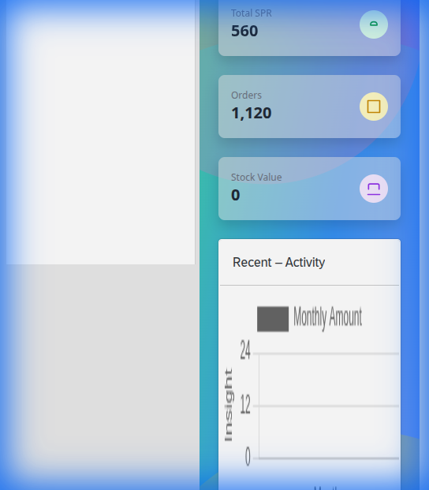

# Purchase Management

The Purchase module handles all procurement activities.

## Overview

- **KPIs**: Track Total SPR, Total Orders, and Stock Value at a glance.
- **Order Management**: detailed views for tracking Purchase Orders (POs) and their status.
- **Supplier Tracking**: Monitor top suppliers and procurement performance.

## Hello World

- **KPIs**: Hello World
- **Order Management**: Hello World
- **Supplier Tracking**: Hello World
